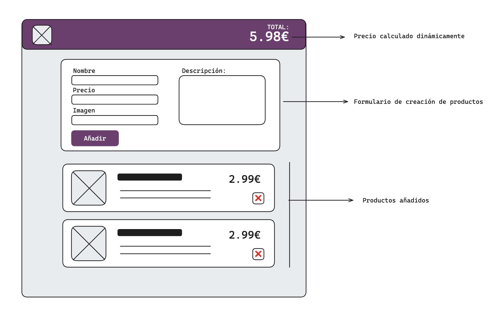
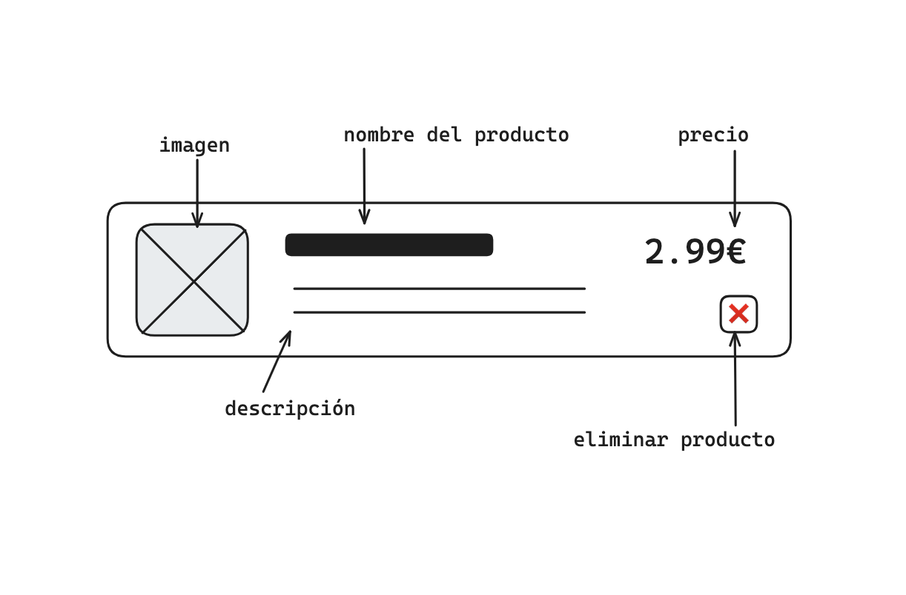
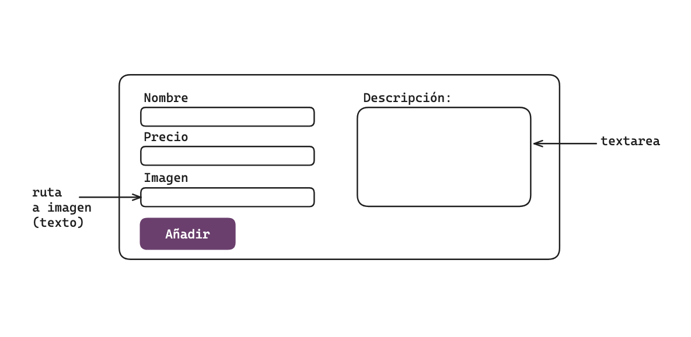

#  IFCD0210: Proyecto desarrollo web en entorno cliente

## Instrucciones
Crear una aplicación web que permita añadir y quitar productos a un listado. 

La aplicación **no es obligatorio que se vea idéntica** a la foto, pero si es recomendable respetar y distinguir visualmente los distintos elementos que la componen:
- Un header con el logo de la aplicación y el precio total de todos los productos mostrados
- Un formulario de creación de producto
- Una sección donde se van añadiendo los productos.

### Productos

Cada producto ha de mostrar su título o nombre, descripción, imagen, precio y un botón para borrar dicho producto de la lista

### Formulario nuevo producto

Dentro de un formulario, será necesario incluir todos los inputs necesarios para poder introducir los datos de un nuevo producto. La imagen será introducida con su ruta a través de un input de tipo texto.

## Requisitos mínimos

- Los diferentes productos se almacenan en una variable `productos` que contiene un array de objetos.
- La página ha de funcionar según el comportamiento esperado.
- Es necesario el uso correcto de formularios HTML.
- Función `añadirProducto(nombre,precio,descripción,imagen)` que añade un nuevo producto a la variable `productos`.
- Función `eliminarProducto()` que elimina dicho producto de la variable `productos`.
- Función `mostrarProductos()` encargada de modificar el HTML y 'pintar' tantos productos como elementos tenga el array `productos`, cada uno de ellos con sus datos correspondientes.

## Extra

Si se ha terminado con lo anterior, se puede optar por hacer una o varias de las siguientes tareas, teniendo en cuenta que no todas tienen el mismo nivel de dificultad:
- hacer la página responsive con mediaqueries y flexbox
- añadir Bootstrap para usar componentes y/o hacerla responsive
- usar otra librería de componentes/CSS en vez de bootstrap como Tailwind o shadcn/ui
- 🔥 editar los productos

